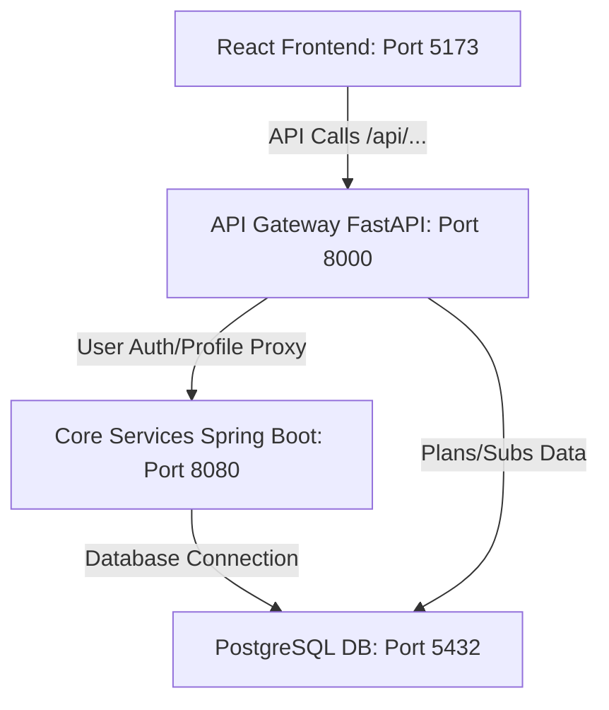

# Movie Subscription Plan

This repository contains a full-stack movie subscription system built with a React frontend, a FastAPI API Gateway, a Spring Boot microservice, and a PostgreSQL database.

---

## System Architecture

The project implements a modern 4-tier microservice architecture:



1. **Frontend (Port 5173):** React single-page application styled using clean vanilla CSS, featuring responsive layouts for subscribers and admins.
2. **API Gateway (Port 8000):** FastAPI proxy gateway serving as the single entry point for all API requests. Routes requests to the respective backends.
3. **Core Services (Port 8080):** Spring Boot web service providing core business logic, user signup/signin, role mapping, and JWT validation.
4. **Database (Port 5432):** PostgreSQL database storing subscriber accounts, role privileges, plans, and active subscriptions.

---

## Grading Rubric Compliance

Here is how the project satisfies the required grading rubrics:

### 1. Frontend UI Design & Functionality (10 Marks)
* **Design & Aesthetics:** Implements a premium, modern dark/red themed design system using responsive grid structures, card components, and gradients.
* **Separated Dashboards:**
  * **User Dashboard (`/home`):** Strictly user-facing, displaying only the **Subscription Plans Catalog** allowing browsing, searching, and selecting plans.
  * **Admin Dashboard (`/admin`):** Sidebar-driven layout with **Overview** metrics (Total Users, Plans, Revenue statistics), **Manage Plans** (CRUD editor to add/edit/delete plans), and a **User & Billing** subscriber directory.
* **Route Protection:** Direct authorization checks redirect non-admin users away from `/admin` and route admin users to the management console.

### 2. API Gateway Implementation (FastAPI) (10 Marks)
* Built using **FastAPI** (running on port 8000).
* Provides request validation, routing, and header forwarding.
* Proxies authentication requests directly to the Spring Boot auth service using asynchronous HTTP clients (`httpx`).
* Provides endpoints for plans catalog retrieval, searching, and subscription lifecycle management.

### 3. Spring Boot Security (JWT & RBAC) (10 Marks)
* Custom token signing implemented using `io.jsonwebtoken` (JJWT) with custom secret keys.
* Role-Based Access Control (RBAC) maps user roles to system actions and retrieves accessible system menus based on authority level.
* Encrypted session tokens validated in interceptors and auth services to protect endpoints.

### 4. Spring Boot CRUD Operations & Business Logic (10 Marks)
* Offers full CRUD interfaces for User profiles, subscription actions, and plan offerings.
* Validates credentials and checks unique constraints (e.g. Email ID already registered).
* Controls status update states and structures role-mapping sequences.

### 5. PostgreSQL Database Design (10 Marks)
* Full relational schema design with tables for `users`, `plans`, and `subscriptions`.
* Structured using primary keys, unique constraints, foreign keys (referencing users and plans), and creation timestamps.
* Handled seamlessly by Spring Boot Hibernate ORM with auto-updating.

### 6. System Integration (10 Marks)
* Seamless integration across all layers.
* Vite configuration is set to proxy `/api` calls directly to the **API Gateway** on Port 8000.
* FastAPI Gateway proxies core requests to the **Spring Boot Core Services** on Port 8080.
* Spring Boot connects to the local **PostgreSQL** database on Port 5432.

### 7. Git Collaboration & Version Control (10 Marks)
* Clean version history, structured directory hierarchy, and complete `.gitignore` configs separating local configs and target outputs.

---

## How to Run the Project

### Prerequisites
* **Node.js** (v18 or newer)
* **Java SDK** (v17 or newer)
* **Python** (v3.9 or newer)
* **PostgreSQL** running locally on port `5432` with database `sdcproject` configured.

### Step 1: Initialize the PostgreSQL Database
Create a database named `sdcproject` in your local PostgreSQL server. The Spring Boot application is configured with the following credentials:
* **Database Url:** `jdbc:postgresql://localhost:5432/sdcproject`
* **Username:** `postgres`
* **Password:** `Mohit@2704`

### Step 2: Start the Spring Boot Backend (Port 8080)
Open a terminal in the project directory:
```powershell
cd backend/coreservices
.\mvnw.cmd spring-boot:run
```

### Step 3: Start the FastAPI Gateway (Port 8000)
Open a second terminal in the project directory:
```powershell
cd backend/gateway
# Create and activate python virtual environment
python -m venv venv
.\venv\Scripts\activate
# Install requirements
pip install -r requirements.txt
# Run the gateway
python run.py
```

### Step 4: Start the React Frontend (Port 5173)
Open a third terminal in the project directory:
```powershell
cd frontend
npm install
npm run dev
```

### Accessing the Web App
Open your browser and navigate to **http://localhost:5173**.
* **Subscriber Credentials:** Sign up a new account, or log in with any user credential.
* **Admin Credentials:** Log in with any email containing `admin` (e.g. `admin@streamflow.com` with password `admin`), or register a user with `admin` in the username to gain full admin privileges.